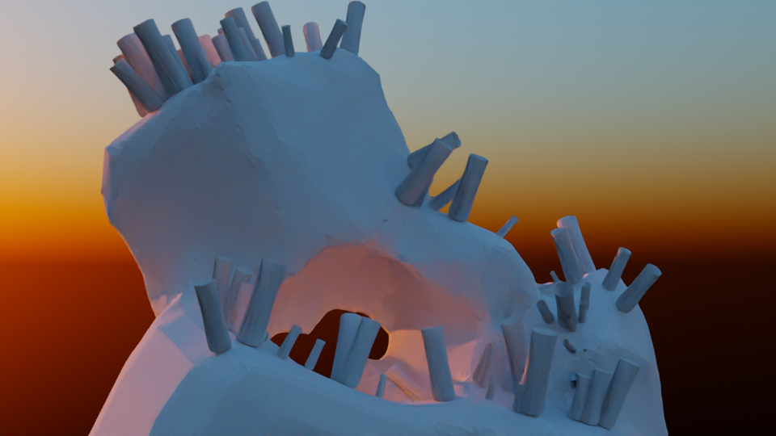
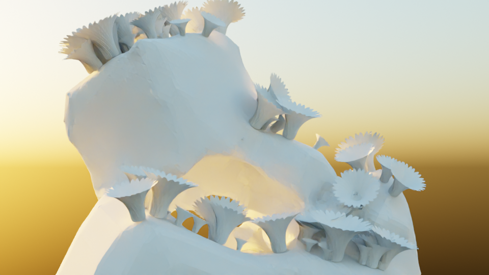

# Flower Motion

Blender Animation

## Inspiration

I like animating foliage and morning flower movement inspired me.

## Tech

Flower petals are modeled manually. Each petal is then assigned with simple deform procedural modifier which bends the petals. This is keyframes.

Array modifier is used to instance animated flower petals in form of a flower.

Particle system is used to instance flowers over stones.

Stones are made using repetition of remesh modifier.

Ideas:
* Procedurally generate colors
* Procedurally generate petal bending amount
* Procedurally generate positions
* Procedurally generate stones

## Results

